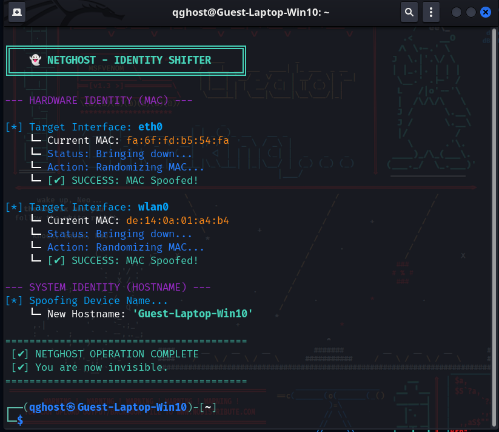
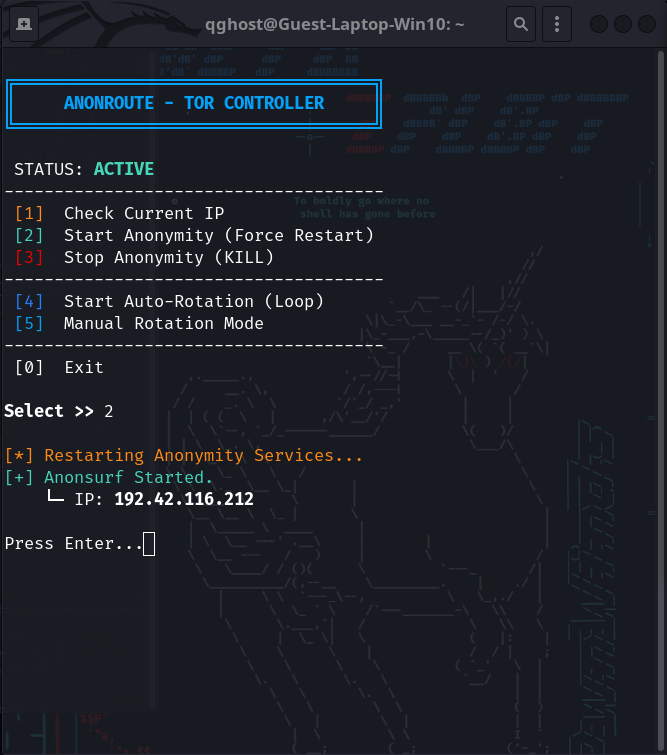
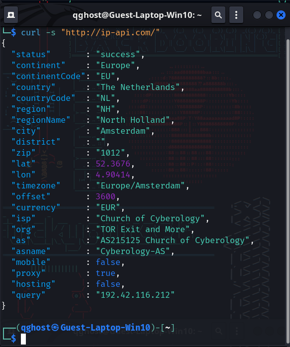
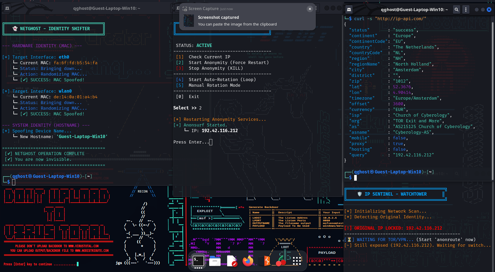
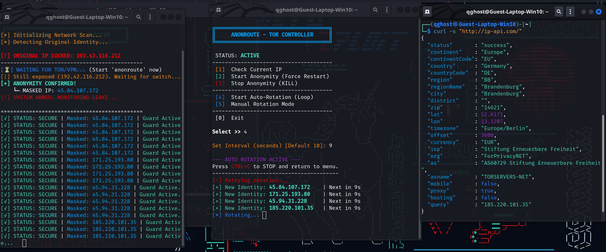
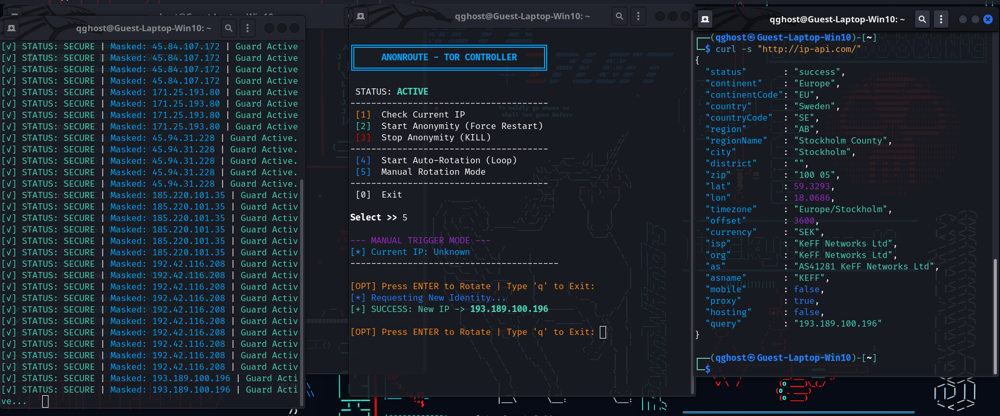
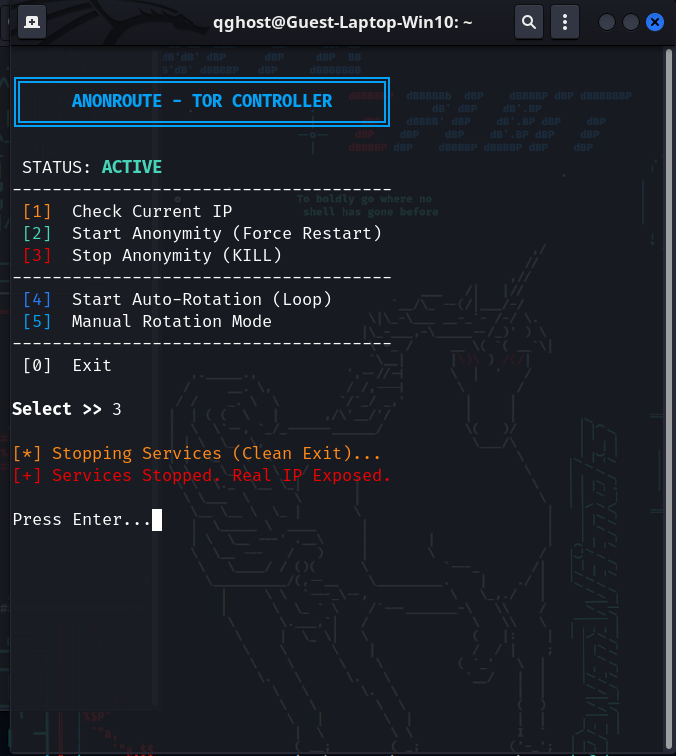
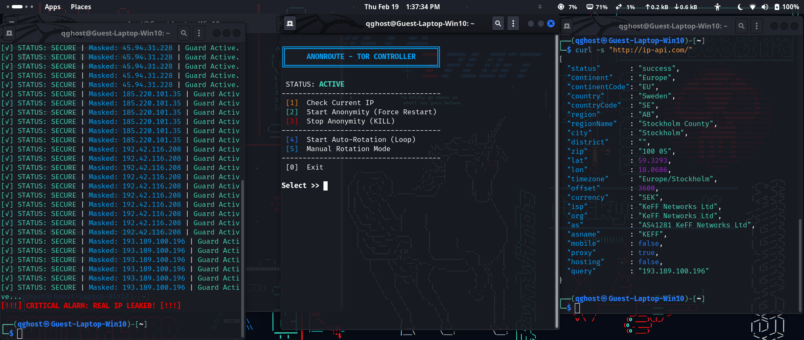
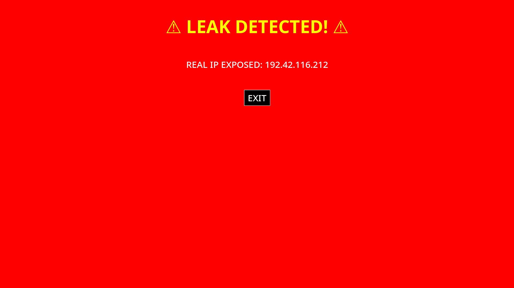

# 🛡️ GHOST PROTOCOL - Advanced Anonymity Suite

> **⚠️ Disclaimer:** This project is developed strictly for **Educational Purposes** and **Authorized Security Testing** (Red Teaming). The tools demonstrated here are designed to help security professionals understand anonymity and leak protection mechanisms.

---

## 🚀 Project Overview
**Ghost Protocol** is a custom-built Python privacy framework designed to act as a complete shield for ethical hackers. It orchestrates Network Identity masking, Tor Routing, and Real-time Leak Detection to ensure zero-trace operations during security audits.

### 🛠️ The Toolset:
1.  **👻 NETGHOST:** Advanced MAC Address & Hostname Spoofer.
2.  **🌐 ANONROUTE:** Tor Network Controller with Auto-Rotation & Force Restart logic.
3.  **🛡️ IP SENTINEL:** Real-time Leak Monitor with GUI Kill Switch.

---

## 📸 Visual Walkthrough (Operation Flow)

### 🔹 Phase 1: Initialization & Masking
**Step 1:** We begin by masking the hardware identity (MAC Address) to bypass local network filtering.

**Step 2:** Activating the Tor Controller to route traffic through the encrypted onion network.

**Step 3:** Verification of the new Identity (ISP & DNS Check).

---

### 🔹 Phase 2: The Command Center
**Step 4:** The **"Ghost Dashboard"**. All three tools running in sync. Netghost handles hardware, Anonroute handles IP, and IP Sentinel watches for leaks.

**Step 5:** **Auto-Rotation Mode** in action. The IP changes automatically every few seconds.

**Step 6:** **Manual Mode** allowing the user to trigger specific IP changes on demand.

---

### 🔹 Phase 3: Defense & Kill Switch
**Step 7:** Simulating a security breach by manually **Stopping Services**.

**Step 8:** **Immediate Detection!** IP Sentinel detects the Real IP exposure instantly in the terminal.

**Step 9:** **LOCKDOWN.** A Full-Screen Red Alert blocks the user from accidental leakage.

---

## 🎥 Live Demonstration
Watch the full system in action, showing the seamless sync between the controller and the monitor.

### [▶️ Click Here to Watch the Demo Video](demo/10_video_demo.mp4)

*(Note: Please download the video if it does not play directly in your browser)*

---

## 🔒 Source Code & Security
**Note:** The source code for this project is currently **Private** to prevent misuse by unauthorized actors. This repository serves as a technical portfolio showcasing the logic, UI design, and implementation capabilities.

### 💻 Tech Stack
* **Language:** Python 3
* **Networking:** Tor, Iptables, MACchanger
* **Modules:** `subprocess`, `os`, `threading`, `socket`, `tkinter` (GUI)
* **OS:** Kali Linux / Debian

---
*Created by [Your Name]*
